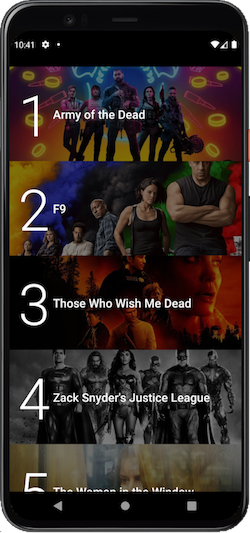
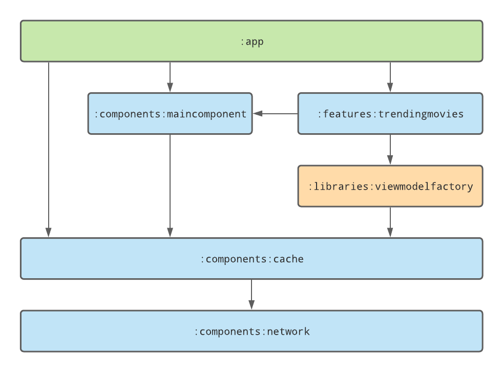
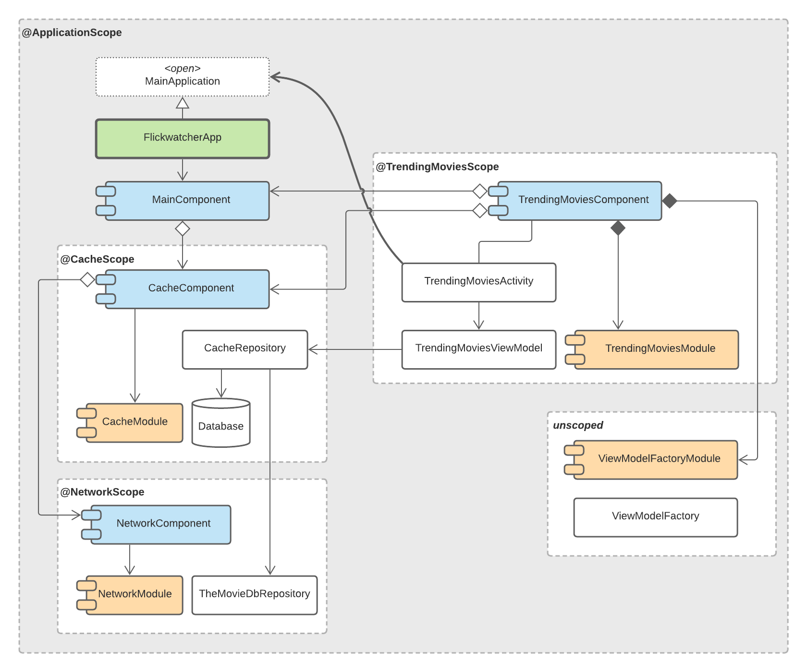

# Flickwatcher

Flickwatcher for Android lets you see today's latest trending movies!

Cool Dependencies:

- [Jetpack Compose](https://developer.android.com/jetpack/compose)
- [Accompanist-Coil](https://google.github.io/accompanist/coil)
- [Kotlin Coroutines](https://kotlinlang.org/docs/coroutines-overview.html)
- [Retrofit](https://square.github.io/retrofit)
- [Room](https://developer.android.com/training/data-storage/room)
- [Jetpack Datastore](https://developer.android.com/topic/libraries/architecture/datastore)

## Architecture

Flickwatcher is designed as an offline-first app with a focus on decoupled modular components and
asynchronous data flow.

- The user interface always loads from the database and does not interact directly with the network
- Data is fetched and provided to the user interface asynchronously, and the user interface is
  updated whenever fresh data has arrived in the database. Powered
  by [Kotlin Flows](https://developer.android.com/kotlin/flow)
- Code is organized into
  single-purpose [Gradle modules](https://docs.gradle.org/current/userguide/multi_project_builds.html)
  that use only the dependencies that they need
- Features and shared modules are encapsulated as
  Dagger [@Components](https://dagger.dev/api/latest/dagger/Component.html)

### Project Structure

### Components

There are no Dagger [@Subcomponents](https://dagger.dev/dev-guide/subcomponents.html), only
[@Components](https://dagger.dev/api/latest/dagger/Component.html) and un-scoped reusable Modules.

